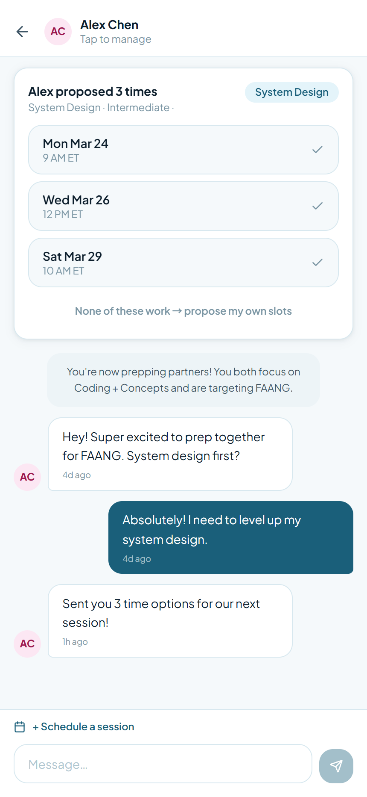

# PairUp — Find Your Interview Partner

> A mobile-first web app that matches NYU CS students with persistent mock-interview prep partners — by goals, level, and availability — and gives every pair a shared space to chat, schedule, and grow together.

---

## Quick Start

**Prerequisites:** Node.js 18+

```bash
# 1. Clone the repo
git clone https://github.com/your-username/pairup.git
cd pairup

# 2. Install dependencies
npm install

# 3. Start the dev server
npm run dev
```

Open [http://localhost:5173](http://localhost:5173) in your browser.
The app is optimised for a **430 × 932 px** mobile viewport — use Chrome DevTools device emulation for the best experience.

### Other commands

```bash
npm run build      # Production build → dist/
npm run preview    # Preview the production build locally
node scripts/screenshot.mjs   # Re-capture all screen screenshots → screenshots/
```

---

## Screenshots

<table>
  <tr>
    <td align="center"><br/><sub><b>Login</b></sub></td>
    <td align="center"><br/><sub><b>Register</b></sub></td>
    <td align="center"><br/><sub><b>Onboarding — Goal</b></sub></td>
    <td align="center"><br/><sub><b>Onboarding — Level</b></sub></td>
  </tr>
  <tr>
    <td align="center"><br/><sub><b>Onboarding — Availability</b></sub></td>
    <td align="center"><br/><sub><b>Discover Feed</b></sub></td>
    <td align="center"><br/><sub><b>User Profile Detail</b></sub></td>
    <td align="center"><br/><sub><b>Send Invite Modal</b></sub></td>
  </tr>
  <tr>
    <td align="center"><br/><sub><b>Matches — Received</b></sub></td>
    <td align="center"><br/><sub><b>Matches — Invited & Waiting</b></sub></td>
    <td align="center"><br/><sub><b>Partner List</b></sub></td>
    <td align="center"><br/><sub><b>Partner Space</b></sub></td>
  </tr>
  <tr>
    <td align="center"><br/><sub><b>Incoming Proposal</b></sub></td>
    <td align="center"><br/><sub><b>Schedule Session Modal</b></sub></td>
    <td align="center"><br/><sub><b>Edit Profile</b></sub></td>
    <td align="center"><br/><sub><b>Settings</b></sub></td>
  </tr>
</table>

---

## The Problem

CS students need accountability partners to survive technical interview prep — but finding one means cold outreach, social friction, and rejection risk that most students, already battling imposter syndrome, simply avoid. Existing tools match you with strangers blindly and reset after every session.

**PairUp fixes this** by matching students on goals and availability, then building a persistent prep partnership with every friction point deliberately removed.

---

## How It Works

1. **Onboard in 3 steps** — choose your role (SDE/PM), practice focus, level, target tier, and weekly availability.
2. **Discover ranked matches** — a LinkedIn-style feed sorted by match percentage, with shared goals called out explicitly on every card.
3. **Send a structured invite** — an auto-filled template removes the blank-page problem; one open field for a genuine personal note keeps it human.
4. **Accept & enter a Partner Space** — one shared environment per partner: chat, upcoming session, history, and the schedule button all in one place.
5. **Propose sessions in 3 slots** — the proposer offers up to 3 time options; the partner picks one. No back-and-forth.
6. **Leave lightweight feedback** — a 3-question post-session prompt updates trust signals (show-up rate, sessions completed) visible to future partners.

---

## Key Design Decisions

| Decision | Rationale |
|---|---|
| **Ranked feed over swipe** | CS students open the app with a specific prep need. A task-first feed matches that intent; swiping signals the wrong mental model. |
| **Persistent Partner Space** | Chat, scheduling, and session history live together under one matched partner. Splitting them across tabs breaks the relationship model. |
| **Structured invite template** | Auto-fills role, focus, and timeline as locked chips — eliminates blank-page paralysis while keeping every invite honest. |
| **"Not available right now" language** | The words "declined" and "rejected" never appear. Declined cards surface similar matches inline to redirect momentum. |
| **3-slot session proposal** | Proposer offers a range; partner picks one. Eliminates the "does this time work?" loop and reduces scheduling to a single decision. |

---

## Tech Stack

| Layer | Technology |
|---|---|
| Framework | React 18 (functional components, hooks) |
| Bundler | Vite 5 |
| Styling | Tailwind CSS 3 with custom design tokens |
| Routing | react-router-dom v6 |
| State | React Context API |
| Icons | lucide-react |
| Font | Plus Jakarta Sans (Google Fonts) |
| Data | Mock data — no backend in V1 |

---

## Project Structure

```
src/
├── components/          # Shared UI components
│   ├── Avatar.jsx
│   ├── AvailabilityGrid.jsx   # 7×3 grid with ET/PT/CT/MT timezone toggle
│   ├── BottomNav.jsx
│   └── MatchBadge.jsx
├── context/
│   └── AppContext.jsx          # Global state (user, partners, invites)
├── data/
│   └── mockData.js             # Mock users, partners, matches
├── pages/
│   ├── auth/                   # Login, Register
│   ├── onboarding/             # Steps 1–3 + Loading screen
│   ├── discover/               # Feed, Profile Detail, Send Invite modal
│   ├── matches/                # Received + Invited & Waiting tabs
│   ├── partner/                # Partner list + Partner Space + Schedule modal
│   └── profile/                # Profile, Edit Profile, Settings
└── utils/
    └── timezone.js             # IANA timezone detection, band/hour helpers
scripts/
└── screenshot.mjs              # Puppeteer script to capture all screens
screenshots/                    # Auto-generated PNG screenshots (430×932 @2x)
```

---

## V1 Feature Coverage

### Authentication
- [x] Register — display name, email, password (≥ 8 chars)
- [x] Login — email, password
- [x] Forgot password — inline flow, no navigation

### Onboarding
- [x] Step 1 — role, practice focus chips, target tier, timeline
- [x] Step 2 — level cards with descriptions, weakest area, background, bio, LinkedIn
- [x] Step 3 — 7×3 availability grid, ET/PT/CT/MT timezone toggle, session preferences
- [x] Post-onboarding loading state

### Discover
- [x] Ranked feed with filter bar (role / level)
- [x] Experienced user card with trust metrics
- [x] New user card with "New to PairUp" badge
- [x] Shared goals box (1–3 specific overlaps per card)
- [x] Post-invite grayed-out card state
- [x] Filter empty state vs. algorithm empty state (distinct)
- [x] User Profile Detail — full profile, read-only availability grid
- [x] Send Invite modal — locked template chips, optional personal note

### Matches
- [x] Received tab — Accept / Decline with context
- [x] Invited & Waiting tab — waiting status, decline recovery flow with inline similar matches

### Partner
- [x] Partner list — last message preview, upcoming session pill
- [x] Partner Space — chat thread, schedule button, message input
- [x] Incoming proposal card — 3 tappable slot options
- [x] Outgoing proposal banner — waiting state
- [x] Schedule Session modal — 4 steps: type → level → slots (up to 3) → confirm + meeting link
- [x] Post-session feedback card — show-up check, star rating, optional comment

### Profile & Settings
- [x] Profile view — read-only with edit shortcut
- [x] Edit Profile — all 13 fields, dirty-state guard, discard dialog
- [x] Settings — change email/password (inline), delete account (type "DELETE"), notification toggles

---

## Roadmap — V2 (Backend + RAG Sprint)

- [ ] User authentication & session management
- [ ] Profile, invite, partner, chat, and session APIs
- [ ] Real-time chat (WebSocket)
- [ ] Layer 1 matching — rule-based scoring on structured fields
- [ ] Layer 2 matching — RAG re-ranking via profile embeddings + pgvector cosine similarity
- [ ] Match reason generation from field overlap
- [ ] LinkedIn OAuth integration — auto-populate profile, re-embed on sync
- [ ] Email notifications — booking confirmation, session reminders, invite alerts
- [ ] Show-up rate computation from post-session feedback
- [ ] Accountability nudge — prompt if no session in 7+ days

---

## Design Principles

This UI was built following the **oiloil UI/UX guide** — key principles applied throughout:

- **Task-first UX** — every screen has one primary action; secondary actions are visually subordinate
- **CRAP hierarchy** — Contrast, Repetition, Alignment, Proximity applied to every component
- **Restrained colour palette** — brand teal (`#1a5f7a`), tinted neutrals, danger red for destructive actions only
- **No emoji as UI** — icons from `lucide-react` only; emoji reserved for user-generated content
- **One CTA per screen** — no competing primary buttons

---

## Author

**Saun Chen** — Product Manager
NYU Tandon School of Engineering

PRD Version 1.0 — V1 Frontend Sprint, March 2026
