# PairUp — Product Requirements Document
**Version:** 1.0 — V1 Frontend Sprint  
**Author:** Saun Chen  
**Last updated:** March 2026

---

## 1. The Problem

CS students need accountability partners to survive technical interview prep — but finding one means cold outreach, social friction, and rejection risk that most students, already battling imposter syndrome, simply avoid. Existing tools match you with strangers blindly and reset after every session. PairUp fixes this by matching students on goals and availability, then building a persistent prep partnership with every friction point deliberately removed.

---

## 2. Who We're Building For

**Persona:** NYU CS undergraduate or graduate student actively preparing for SDE or PM internship or full-time roles.

| Insight | Design Constraint |
|---|---|
| Task-driven socializing — users open PairUp for a specific prep need, not to make friends | Product framing is a collaboration tool, not a social app. Onboarding starts with "What are you preparing for?" |
| Minimum viable setup — every field must justify its existence | Onboarding is 3 steps maximum. Each field is labelled with why it is collected. |
| Low rejection risk — CS students fear rejection and protect self-esteem | Match reasons shown before sending an invite. Declines reframed as "not available right now." Similar matches surfaced immediately after a decline. |

---

## 3. Why Existing Solutions Fall Short

| Pain Point | Exponent | PairUp |
|---|---|---|
| Partner visibility | None — matched blindly after booking | Full profile and match reason before any action |
| Matching quality | Interview type + coarse 3-tier level | Role, practice focus, level, timeline, availability, RAG embedding |
| Relationship model | One-time, re-matched every session | Persistent — same partner, shared history |
| Scheduling | User picks time without seeing partner availability | Proposer sends up to 3 slots, partner picks one |
| Pre-session warmup | None | Structured icebreaker on match, chat before scheduling |
| Post-session continuity | No mechanism to rebook | One-tap rebook inside Partner Space |

**Positioning:** Exponent solves the logistics problem. No product currently solves peer accountability for CS interview prep at the relationship level. PairUp owns that gap.

---

## 4. What We Built

PairUp is a mobile-first web app structured around five stages of a prep partnership.

A student opens the app and lands on a ranked **Discover** feed — not a swipe interface, but a LinkedIn-style list of compatible candidates sorted by match percentage, each showing shared goals and overlapping availability. When they find someone promising, they send a structured invite: auto-filled with their own profile data, with one open field for a genuine personal observation.

The recipient sees the invite in their **Matches** inbox with full context — goal, level, and the personal note — before deciding. On acceptance, both users enter a **Partner Space**: a shared environment containing their chat, their upcoming session, their scheduling tool, and their session history, all in one place. There is no switching between tabs to manage a relationship.

From the Partner Space, either user can propose up to three one-hour slots. The other picks one, both receive a confirmation email, and the session is on the calendar. After the session, a lightweight prompt asks whether the partner showed up and how the session went — updating the trust signals visible on their profile to future users.

The matching algorithm runs in two layers. Layer 1 filters and ranks candidates by structured fields: role, practice focus, level, target tier, timeline, and availability overlap. Layer 2 re-ranks results using RAG: each user's profile is embedded into a vector space and ranked by cosine similarity, capturing compatibility that tags alone miss. This is a product decision, not an engineering detail — it means a sparse user base still produces meaningfully differentiated recommendations at launch.

---

## 5. Key Design Decisions

**Discover: LinkedIn feed over dating swipe**  
CS students open PairUp with a specific prep need. A swipe interface signals the wrong mental model. A ranked feed with persistent filters matches how task-driven users navigate — by purpose, not curiosity.

**Matches: invitation inbox over social feed**  
Received invites show full sender context so recipients make informed decisions. Declined or unanswered invites never use the word "rejected" — they become "this person isn't available right now" with similar matches shown inline. Momentum is redirected, not killed.

**Partner Space: one shared space per match**  
Chat, scheduling, session history, and the schedule button live together under one matched partner. Splitting these across tabs breaks the mental model. Everything with a person stays with that person.

**Structured invite template**  
Free-text invite fields produce hollow messages or paralysis. A template auto-fills the sender's role, focus, and timeline — eliminating the blank page — and leaves one open field for a genuine personal observation. Credentials are locked to keep every invite honest.

---

## 6. What We Cut and Why

**Resume upload** — No parser in V1. Collecting data we cannot use creates false matching quality expectations and unnecessary privacy exposure. LinkedIn sync ships in V2 to reduce manual fill-in and provide richer content for RAG embedding.

**In-app video** — Google Meet and Zoom links solve the problem without infrastructure cost.

**Group matching** — One-on-one pairing solves the core accountability problem first. Group coordination complexity is a V2 problem after the bilateral model is proven.

---

## 7. Feature Checklist — V1 (Frontend Sprint)

### Authentication
- [ ] Register screen — display name, email, password
- [ ] Login screen — email, password, forgot password flow
- [ ] Forgot password — email entry, OTP verification, reset password, confirmation

### Onboarding (3 steps)
- [ ] Step 1 — Role selection (SDE / PM), practice focus chips, target company tier, timeline
- [ ] Step 2 — Level selection with descriptions, weakest area chip, background, optional bio, optional LinkedIn URL
- [ ] Step 3 — Weekly availability grid (7 × 3, AM 8–12 / PM 12–5 / Evening 5–10 ET), who goes first preference, feedback style preference
- [ ] Post-onboarding loading state — "Finding your matches..."
- [ ] Empty state — "We're finding your matches. We'll notify you when a compatible partner is ready."

### Discover
- [ ] Recommendation feed — ranked list with filter bar (role / level)
- [ ] Experienced user card — avatar, name, background badge, match %, 2 trust metrics (sessions / show-up rate), role + practice focus + level + tier tags, shared goals box with availability overlap, Send invite + View profile actions
- [ ] New user card — same as above with "New to PairUp" badge replacing trust metrics
- [ ] Post-invite state — card grays out with "Invite sent" label
- [ ] User Profile detail — full profile view with sticky "Send invite to [Name]" CTA
- [ ] Send Invite modal — structured template with locked auto-filled chips, one optional free text field (0–80 chars), Edit profile link, Send / Cancel actions

### Matches
- [ ] Received tab — invite cards with sender context, Accept / Decline actions
- [ ] Accept flow — celebration animation, transition to Partner tab
- [ ] Decline flow — card disappears immediately, no record stored
- [ ] Invited & Waiting tab — sent invite cards with "Waiting for response" status
- [ ] Decline / expiry flow — card grays out, "not available right now" label, inline 2-card recommendation strip, card disappears after interaction

### Partner
- [ ] Partner tab — list of matched partners with last message preview and upcoming session pill
- [ ] Partner Space — header, upcoming session card (if booked), chat thread, "+ Schedule a session" button, message input
- [ ] First entry state — system intro card, icebreaker template pre-loaded with topic chips
- [ ] Schedule Session modal — 4 steps: interview type, level, propose up to 3 one-hour slots (hourly picker within availability bands), confirm with meeting link input
- [ ] Partner response flow — "Pick a time" card in chat, None work fallback, round 2 proposal
- [ ] Session confirmation state — summary card in chat, email sent confirmation
- [ ] Post-session feedback prompt — show-up check, experience rating (1–3), optional comment, optional app suggestion
- [ ] Session history — chronological list below chat
- [ ] Disconnect — tap avatar → confirm dialog → silent removal

### Profile & Settings
- [ ] Own Profile view
- [ ] Edit Profile — all onboarding fields pre-populated and editable, Save button, unsaved changes dialog
- [ ] Settings — change email, change password, delete account, notification toggles (invitation received / match confirmed / session reminder — booking confirmation always on and hidden)

---

## 8. Feature Checklist — V2 (Backend + RAG Sprint)

### Backend & Infrastructure
- [ ] User authentication
- [ ] User profile API
- [ ] Matching API — Layer 1 rule-based scoring endpoint
- [ ] Invite API — send, accept, decline, expiry logic
- [ ] Partner API — create partnership, fetch partner list, disconnect
- [ ] Chat API — message send/receive, real-time updates (WebSocket or polling)
- [ ] Session API — propose slots, confirm, cancel, history
- [ ] Feedback API — store show-up result, experience rating, app suggestions
- [ ] Notification service — email confirmations, reminders, invite alerts
- [ ] Show-up rate computation — update on feedback submission

### RAG Matching (Layer 2)
- [ ] Profile text pipeline — concatenate role + practice focus + level + background + bio per user
- [ ] Embedding generation — call embedding API on profile create and update
- [ ] Vector storage — pgvector on Postgres
- [ ] Similarity re-ranking — cosine similarity query on top of Layer 1 results
- [ ] Match reason generation — derive shared goals text from field overlap

### LinkedIn Integration (V2)
- [ ] LinkedIn OAuth flow
- [ ] Profile field parser — extract role, skills, education, experience
- [ ] Auto-populate Edit Profile from LinkedIn data
- [ ] Re-embed profile after LinkedIn sync
- [ ] Prompt in Edit Profile: "Sync LinkedIn for better matches"

### Post-Session & Accountability
- [ ] Structured feedback rubric — Clarity / Problem-solving / Communication ratings
- [ ] Session reminder emails — 30 min before scheduled start
- [ ] Accountability nudge — prompt if matched pair has no session in 7+ days (Stretch)
- [ ] Group matching — 3–4 person sessions (Stretch)

---

## 9. Screen Walkthrough

One section per V1 screen in delivery order. Each section contains a screenshot placeholder, a short description, and the key interaction rules a developer must implement correctly.

---

### 9.1 Register

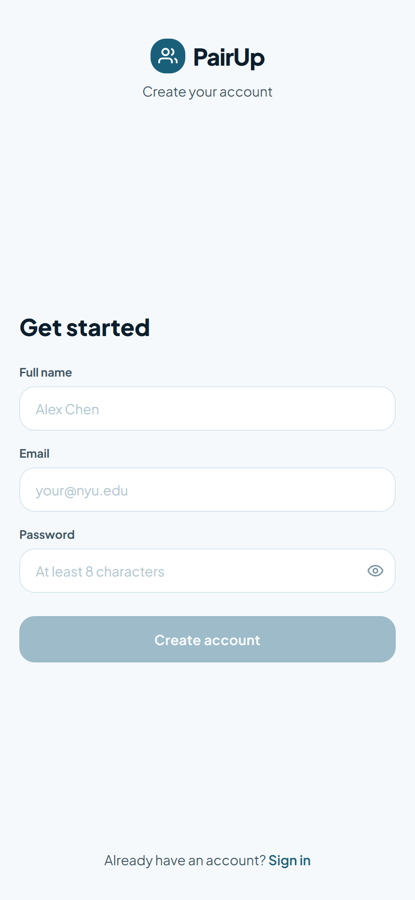

Three fields — display name, email, password — with a minimum 8-character password constraint. Display name entered here carries forward as the pre-fill for Onboarding Step 1's display name field. The screen is intentionally thin: no email verification, no social login, no secondary confirmation field. Getting users to onboarding in the fewest possible taps is the only goal of this screen.

- Password field has a show/hide toggle; inline error appears below the field when input is present but fewer than 8 characters
- "Create account" button is disabled until all three fields are non-empty and password is ≥ 8 characters
- "Sign in" link navigates to Login; no modal, no overlay

---

### 9.2 Login / Forgot Password

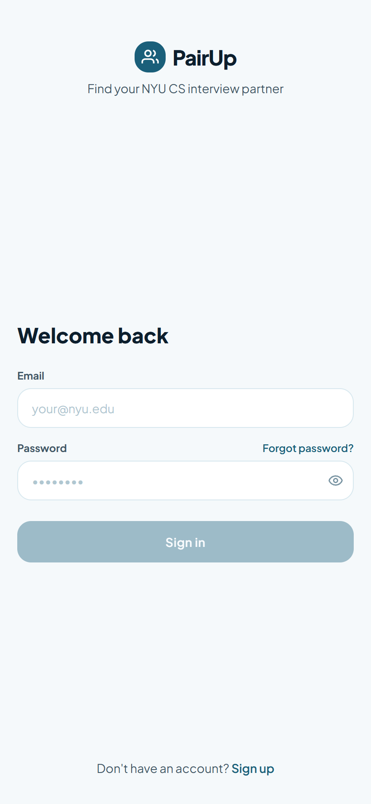

Email and password fields with a "Forgot password?" link that replaces the password field inline — no navigation, no new screen. The forgot-password sub-flow collects an email and shows a confirmation state without leaving the login screen. This reduces the cognitive cost of recovering access to a single, contained interaction.

- "Sign in" button is disabled until both email and password are non-empty
- "Forgot password?" swaps the form inline; "Back to login" restores the original form without losing the typed email
- Post-submission confirmation state shows a success icon and copy; does not auto-navigate

---

### 9.3 Onboarding Step 1 — Goal

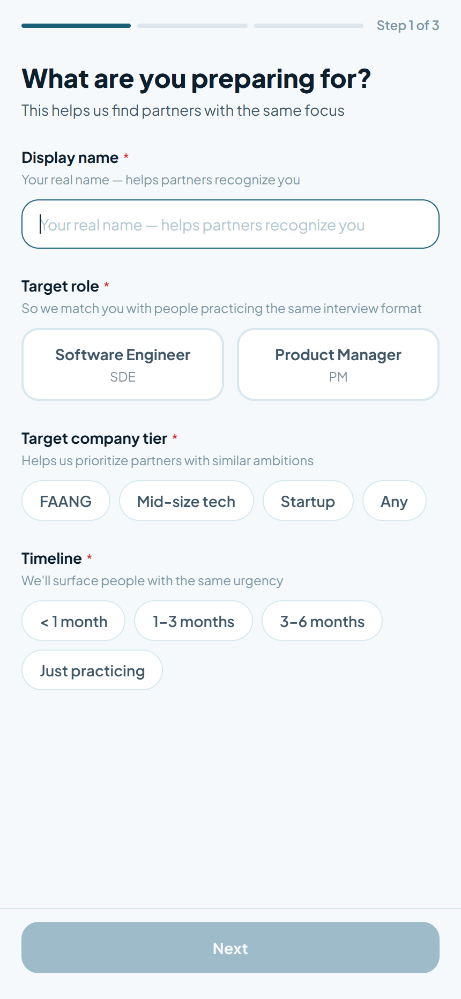

Captures the four core matching signals: display name, role, practice focus, target company tier, and timeline. The step progress bar is always visible. Display name is the first field because it appears on every partner-facing card — naming the user before they choose preferences prevents a blank profile at the point of first match. The product framing ("What are you preparing for?") anchors the mental model as a tool, not a social app.

- Practice focus chips render only after a role is selected; changing role resets focus selections to empty
- "Any" on company tier is mutually exclusive with FAANG, Mid-size tech, and Startup — selecting one deselects the other
- "Next" is disabled until all four fields have a value; no skip option exists

---

### 9.4 Onboarding Step 2 — Level & Background

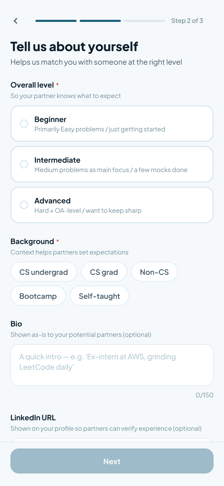

Captures self-assessed level, optional weakest area, background, and optional bio and LinkedIn URL. Level is shown as selectable cards with description text rather than a dropdown — the copy ("Primarily Easy problems / just getting started") reduces ambiguity and sets accurate partner expectations before any connection is made. Every optional field is labelled with why it is collected.

- Weakest area chips are derived exclusively from the practice focus selections made in Step 1; changing role in Step 1 clears this field
- Bio is capped at 150 characters; a live character counter is shown
- "Next" is disabled until level and background are selected; all other fields are optional

---

### 9.5 Onboarding Step 3 — Availability & Preferences

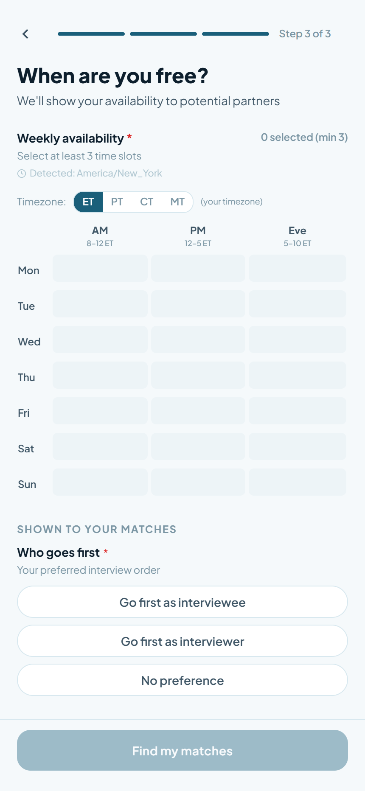

A 7 × 3 weekly availability grid (Mon–Sun × AM / PM / Evening) with an ET/PT/CT/MT timezone toggle and an auto-detected timezone label. Who goes first and feedback style are collected here and displayed to matches. The minimum 3-cell selection requirement is enforced with a live counter, not an error message on submit — users see their progress in real time.

- Grid column headers show the band label and the ET time range (e.g. "AM / 8–12 ET"); toggling timezone changes the sub-labels for display only — stored values remain as band keys (AM / PM / Evening)
- Browser timezone is auto-detected and shown as a read-only label; the toggle is a manual override for users in non-standard locations
- "Find my matches" is disabled until ≥ 3 cells are selected, who goes first is set, and feedback style is set

---

### 9.6 Discover Feed — Experienced User Card + New User Card

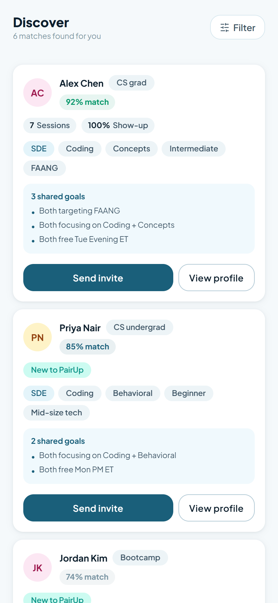

A ranked vertical feed of compatible candidates sorted by match percentage. Two card variants: experienced users (≥ 3 completed sessions) show trust metrics — sessions completed and show-up rate; new users replace that row with a teal "New to PairUp" badge. Every card includes a shared goals box with 1–3 specific overlaps derived from field matching, always including an availability overlap if one exists. The feed uses a persistent filter bar rather than a separate browse mode.

- After an invite is sent, the source card grays out and shows "Invite sent" — it cannot be interacted with again in the same session
- Filter bar (role / level) filters in-memory; zero filtered results shows "No matches with these filters" with a Clear filters CTA — distinct from the zero-algorithm-results empty state
- Zero algorithm results shows an illustration, "We're finding your matches" copy, a bell toggle for match-ready notifications, and an "Update your preferences" link — no spinner, no empty list
- Shared goals box always shows 1–3 items; the list is specific ("Both targeting FAANG", "Both free Tue Evening ET") — generic overlap text is not acceptable

---

### 9.7 User Profile Detail

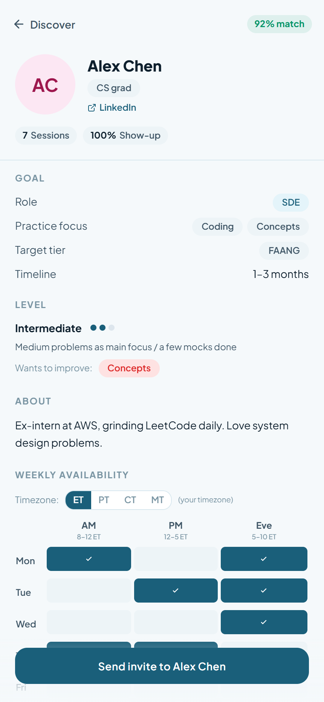

A full-page profile view reached from a Discover card's "View profile" button. Sections run top to bottom: hero (avatar, name, background badge, optional LinkedIn link), trust metrics or new-user badge, goal, level (with pip visual and weakest area chip), about (bio), weekly availability grid (read-only, with timezone toggle), and session preferences. A sticky "Send invite to [Name]" CTA is pinned at the bottom throughout scroll.

- Availability grid is read-only; the timezone toggle is present for the viewer's reference
- LinkedIn row is hidden entirely when the field is blank — no empty placeholder
- Sticky CTA grays to "✓ Invite sent" after invite is sent from this screen; it cannot be tapped again
- Weakest area is shown as a red-tinted chip only when the field is set; the row is hidden otherwise

---

### 9.8 Send Invite Modal

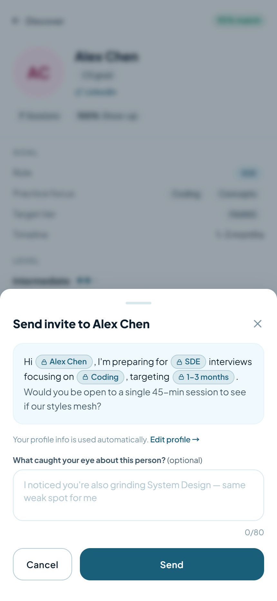

A bottom sheet that slides up from the Discover card or the Profile detail sticky CTA. The message template auto-fills the recipient's name and the sender's role, focus, and timeline as locked chips — visually distinct from input fields. One optional free-text field (0–80 characters) lets the sender add a genuine personal observation. The template design eliminates the blank-page problem while keeping every invite honest about the sender's credentials.

- Auto-filled tokens render as locked chips with a padlock icon; they are not editable and cannot be cleared
- "Send" is always enabled — the personal note is optional; "Cancel" dismisses the sheet without side effects
- Post-send: button label changes to "✓ Sent", sheet auto-dismisses after 1.5 s, and the source card grays out on Discover
- "Edit profile →" link at the bottom of the modal navigates to Edit Profile without losing the modal state on return

---

### 9.9 Matches — Received Tab

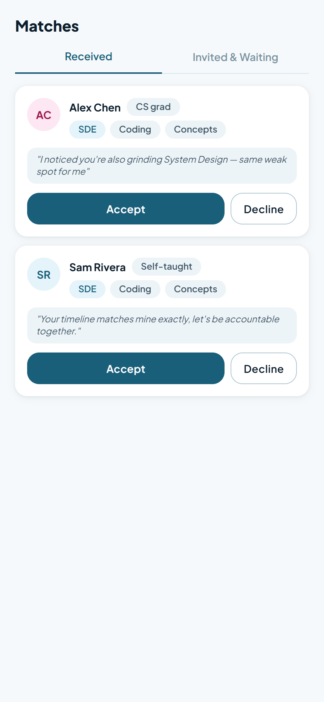

Pending incoming invites, each showing the sender's avatar, name, background badge, role and focus tags, and their optional personal note. The recipient has full context before deciding — this is the deliberate design choice that separates PairUp from blind-match tools. Accept and Decline are equal-weight buttons; neither is destructive in tone.

- Accept triggers a brief celebration animation, then transitions to the Partner tab with the new Partner Space initialised
- Decline removes the card immediately with no confirmation dialog and no stored record; the sender is never notified of the decline
- Empty state is shown when no invites are pending; no distinction is made between "never received any" and "all cleared"

---

### 9.10 Matches — Invited & Waiting Tab

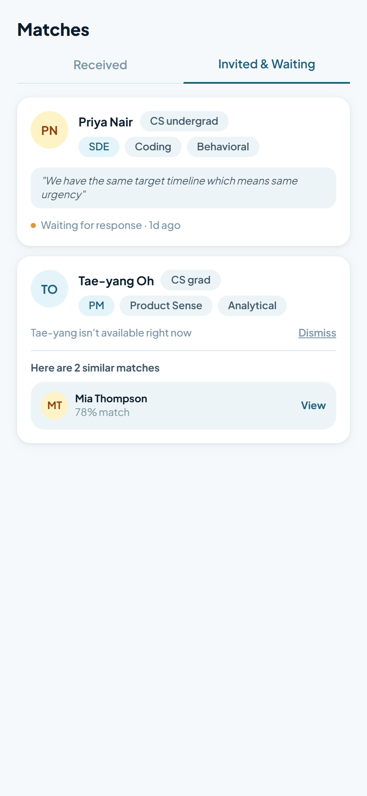

Sent invites waiting for a response. Each card shows the recipient's profile context and a "Waiting for response" status with relative timestamp. When a recipient declines or 48 hours passes, the card grays out and the status changes to "[Name] isn't available right now" — the words "declined" and "rejected" do not appear anywhere in the product.

- Grayed-out cards show an inline 2-card recommendation strip ("Here are 2 similar matches") with View buttons linking to those profiles
- After the user taps View or dismisses, the grayed card disappears entirely — no history is stored
- No action buttons exist on waiting cards; the user cannot withdraw a sent invite in V1
- Users may re-invite the same person in a future session with no restriction; no cooldown is enforced

---

### 9.11 Partner Tab — List View

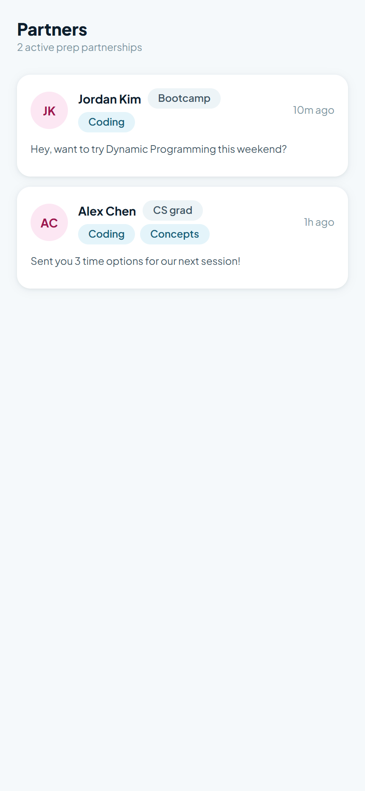

One card per accepted match, ordered by most recent activity. Each card shows the partner's avatar, name, background badge, shared practice focus tags, last message preview truncated to one line, relative timestamp, and an upcoming session pill if a session is booked. The list is the entry point for all ongoing relationships — nothing about a partnership lives outside this view.

- Last message preview truncates at one line with ellipsis; no expand-in-place
- Upcoming session pill renders only when a session is booked; it displays date, type, and is omitted entirely when no session exists
- Empty state includes a CTA to the Matches tab, not a generic "nothing here" message
- Tapping anywhere on a card navigates into the Partner Space for that partner

---

### 9.12 Partner Space — First Entry & Active State

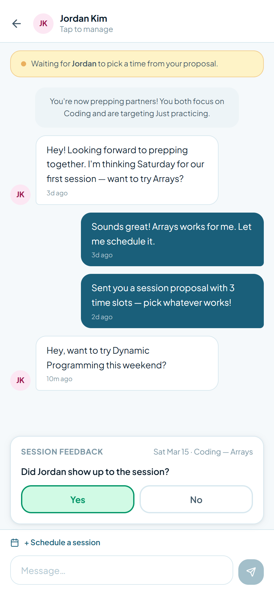

A full-screen space scoped to one matched partner. From top to bottom: header (partner avatar + name, tap to manage/disconnect), optional upcoming session pill, optional proposal card (incoming or outgoing status), chat thread, optional post-session feedback card pinned above the input, and the message input with a persistent "+ Schedule a session" button. First entry auto-posts a system intro card and pre-loads an icebreaker template in the message input.

- Incoming proposal renders as a card above the chat thread, not as a chat bubble; it shows the proposer's name, session type and level, and three tappable slot cards
- Outgoing proposal renders as a yellow status banner ("Waiting for [Name] to pick a time") — not a card with actions
- First-entry icebreaker is pre-loaded text in the message input; the user can edit or clear it before sending
- Tap on partner avatar in the header opens a disconnect confirmation dialog, not a profile view

---

### 9.13 Schedule Session Modal — Steps 1–4

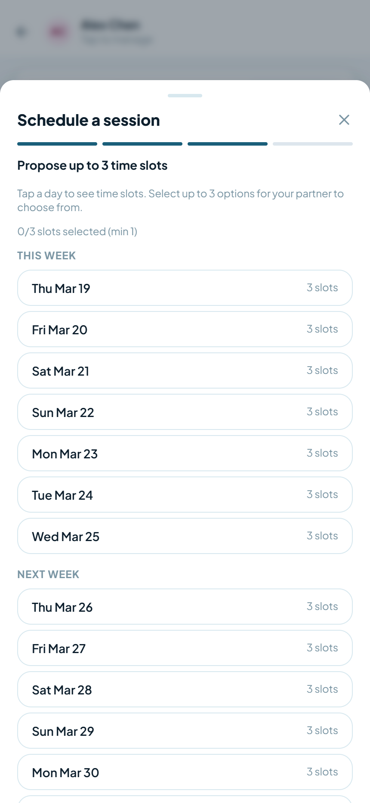

A 4-step bottom sheet: Step 1 selects interview type, Step 2 selects level, Step 3 proposes up to 3 one-hour slots from a two-week calendar, Step 4 confirms with a required meeting link. The proposer does not pick a single time — they offer a range and the partner picks. This eliminates the back-and-forth of "does this time work?" and reduces scheduling friction to a single partner decision.

- Step 3: days with no matching availability bands are rendered as disabled; available days expand on tap to show hourly slots derived from the user's stored availability bands
- Selected slots appear as removable chips above the calendar; the minimum to proceed is 1 and the maximum is 3
- Step 4: the meeting link field (Google Meet or Zoom URL) is required; "Send proposal" is disabled until the field is non-empty
- On send, a system message posts to the chat thread and the proposal card appears for the partner

---

### 9.14 Post-Session Feedback Prompt

A three-question card pinned above the message input when a past session has feedback pending. Q1 asks whether the partner showed up (Yes / No). Q2 asks for a 1–3 star session rating with an optional free-text comment. Q3 solicits an optional app suggestion visible only to the PairUp team. The prompt does not block the chat — users can message while it is visible.

- Q1 No path: shows a brief acknowledgement message and auto-dismisses after 2 s; partner's show-up rate decrements in V2 on the backend
- Q2 star rating is required to advance; the comment field is optional
- Q3 is fully optional; both Skip and Submit complete the flow and remove the card
- The card is removed from the UI immediately on completion; it does not reappear

---

### 9.15 Edit Profile

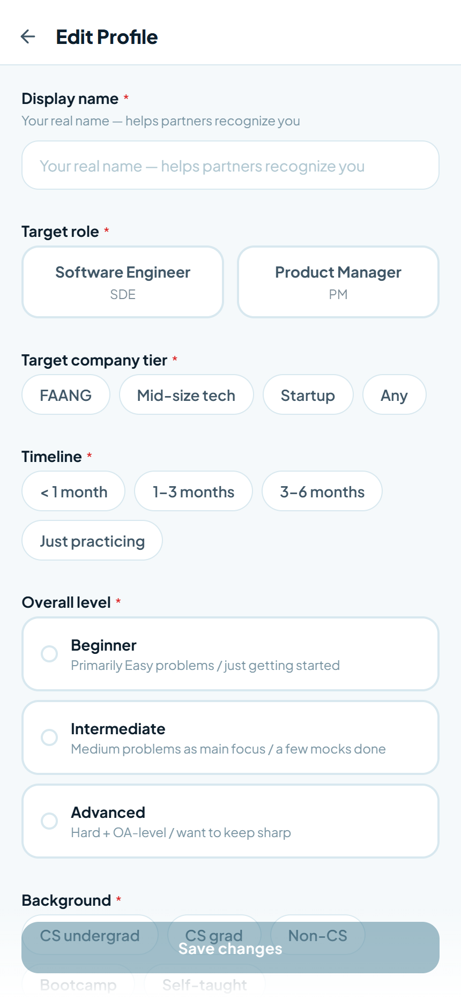

All 13 onboarding fields in a single scrollable page, pre-populated from the user's onboarding data — no blank state. The Save button is pinned at the bottom and is disabled until at least one field has changed. A "Discard changes?" confirmation dialog fires on back-press when any field is dirty. Saving immediately propagates the display name change to all partner-facing surfaces in the current session.

- Changing role resets practice focus and weakest area to empty; the user must re-select
- Save button label changes to "✓ Saved" briefly before navigating back to Profile
- Unsaved changes dialog offers "Keep editing" (returns to form) and "Discard" (exits without saving) — no third option
- Availability grid in Edit Profile is interactive, not read-only; the timezone toggle is present

---

### 9.16 Settings

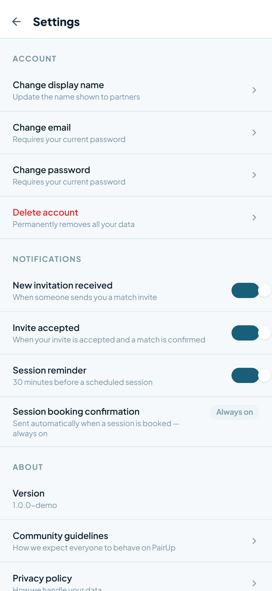

Three sections: Account, Notifications, and About. Account rows (change email, change password) expand inline — no navigation away from the screen. Delete account requires the user to type "DELETE" exactly before the confirm button enables. Notification toggles cover the three user-controlled types; session booking confirmation is displayed as always-on with no toggle, making the product policy visible without creating a false expectation of control.

- Change email and change password expand and collapse in place; submitting either shows a success message inline without navigating away
- Delete account: the confirm button is disabled until the input matches "DELETE" exactly (case-sensitive); on confirm, the user is navigated to the Login screen
- "Change display name" row links to Edit Profile, not an inline field — display name editing is intentionally consolidated there
- Notification toggle state persists in context across the session; V2 syncs to the backend
